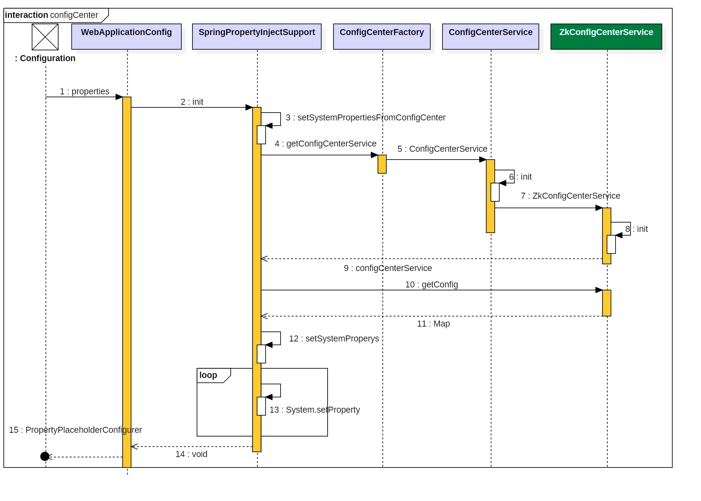

# 统一配置中心方案

 [统一配置中心1](http://www.cnblogs.com/ASPNET2008/p/5166922.html)中记录了我之前项目中如何处理多系统中的配置问题，对于统一配置中心组件一般分为两种做法：
## 自建
它的好外与缺点都非常明确。
### 好处
+ 设计以及代码实现都由自己把控，可形成自己的知识积累
+ 设计可以足够简化，无需考虑过多场景
+ 能够快速适应项目的需求，无需考虑开源的是否支持

### 缺点
+ 需要人力的投入，而且有重复造轮子的嫌疑，需要有足够的说服力
+ 对技术有一定要求，如果写出来的组件问题多或者通用性不强会形成浪费的局面
+ 缺少权威性，需要长时间的推进

## 开源
开源的配置中心，我之前有提到过百度的disconf，还有当当的config-toolkit,这些产品都有很多应用案例，功能也非常全。
### 好处
+ 权威性相对好，成功案例多的组件往往在技术推进上很比较容易
+ 不需要过多的人力投入，往往只需要一步一下按步骤来
+ 通用性比较强，适用的场景相对广泛

### 缺点
+ 可能并不完全与实际需求相符，需要通过一些扩展来支持
+ 可能会是重量级组件，而你的需求只使用其中一小部分
+ 可能存在BUG
+ 组件升级不受使用者控制

# 自建的方案

## 场景
当系统越来越多后，每个系统的配置如果没有统一的管理机制那么会非常难管理，需要有一种侵入性小的方案来将这些原本在单项目中维护的配置工作统一管理起来。

## 配置存储
推荐使用zookeeper来存储项目中的配置项，也可以是其它的存储。下面设计的配置中心组件是可扩展，但实现暂时只实现了zookeeper。

## 核心思路
在系统加载时，想办法将存储在zookeeper中的配置内容加载到系统变量中，然后程序就可以像调用本地配置文件一样了，不需要改变现有系统引用变量的行为。至于本地配置文件直接使用Spring自带功能即可，当然也可以统一在组件中。

## 实际需求
+ 配置存储在zookeeper
+ 支持本地配置
+ 有本地配置的情况下，以本地配置为准（本地调试）
+ 支持zookeeper热更新，即在运行时当zookeeper信息发生变更时能够实时同步到程序中
> 不需要支持本地文件的热更新


## 设计实现
### 时序图
内容有点多，先看下配置加载的时序图，不包含事件通知以及热更新。


### 启动组件入口
PropertyPlaceholderConfigurer,可以利用它来启动组件的初始化进而从zookeeper中加载数据到系统中，即先加载zookeeper数据然后加载本地配置文件。

``` java
@Bean
public static PropertyPlaceholderConfigurer properties() {
    SpringPropertyInjectSupport springPropertyInjectSupport=new SpringPropertyInjectSupport();
    springPropertyInjectSupport.setConfigNameSpaces("configcenter/"+System.getProperty("env"));
    springPropertyInjectSupport.init();
    PropertyPlaceholderConfigurer ppc = new PropertyPlaceholderConfigurer();
    Resource[] resources = new ClassPathResource[]
            { new ClassPathResource( "application.properties" ) };
    ppc.setLocations( resources );
    ppc.setIgnoreUnresolvablePlaceholders( true );
    return ppc;
}
```
SpringPropertyInjectSupport,是自定义的组件启动类，它负责加载zookeeper中的数据到系统：核心方法是init。
``` java
public void init() {
    if (this.configNameSpaces != null) {
        this.setSystemPropertiesFromConfigCenter();
    }
}
```
> configNameSpaces是统一配置中心管理所有节点的父结点，比如configcenter/test是指测试环境的配置，系统中的配置节点名称不包含这些与框架相关的信息，只需要配置dataSource=XXX即代表configcenter/test/dataSource这个配置项。

ConfigCenterFactory是个单例用来返回统一配置中心实例，ConfigCenterService是配置接口，然后由配置接口获取所有的配置项（类型是一个Map），最后将Map中的信息导入到系统变量中。

```java
private void setSystemPropertiesFromConfigCenter() {
    if (StringUtils.isBlank(this.configNameSpaces)) {
        return;
    }
    ConfigCenterFactory.getInstance().setSystemNameSpace(this.configNameSpaces);
    ConfigCenterService cc = ConfigCenterFactory.getInstance().getConfig(this.configNameSpaces);
    Map<String, Object> config = cc.getConfig();
    setSystemProperys(cc, config);

}

private void setSystemProperys(ConfigCenterService cc, Map<String, Object> config) {
    for (String key : config.keySet()) {
        String value = cc.get(key);
        if (key.contains(".")) {
            key = key.substring(1);
        }
        if (value == null) {
            value = "";
        }
        System.setProperty(key, value);
    }
}
```

### ConfigCenterFactory
实例化配置组件，为了支持同时加载多个不同节点下的数据，所以以nameSpace做为key将实例放在Map中，比如想同时访问商品以及订单的配置，它们的namespace分别为
+ configcenter/order/test
+ configcenter/product/test

``` java
private static final Object lockObj = new Object();
private ConcurrentHashMap<String, ConfigCenterService> configCenterCache = null;
public ConfigCenterService getConfig(final String hosts, final String nameSpace) {

    Preconditions.checkNotNull(hosts);
    Preconditions.checkNotNull(nameSpace);

    StringBuilder sb = new StringBuilder(hosts);
    sb.append(nameSpace);

    final String key = sb.toString().intern();

    ConfigCenterService config = this.configCenterCache.get(key);
    if (config == null) {
        synchronized (lockObj) {
            if (!this.configCenterCache.containsKey(key)) {
                ConfigOption co = new ConfigOption(nameSpace, hosts);
                ConfigCenterService cc = new ConfigCenterServiceImpl(co);
                this.configCenterCache.put(key, cc);
            }
        }
    } else {
        return config;
    }

    return this.configCenterCache.get(key);
}
```

### ConfigCenterService
配置管理接口，主要包含三部分内容：
+ 返回所有数据为一个Map
+ 数据更新通知，当某个配置变更后需要触发的功能。
> 不是更新系统中的变量，是指系统中的变量发生改变之后需要做什么？比如数据库的配置发生变化，此时需要重新刷新数据库连接池的信息等。
> 一些获取配置的协助类，即强类型化返回配置，减少调用端的类型转换。

```java
public interface ConfigCenterService {
    public Map<String,Object> getConfig();
    public String get(String key);
    public Long getLongValue(String key);
    public Integer getIntegerValue(String key);
    public Double getDoubleValue(String key);
    public Boolean getBooleanValue(String key);
    public void notify(DataChangeEvent event);
    public void colse();
}
```

### AbstractConfigCenterService
一些通用的逻辑实现放在这里。

### ZkConfigCenterServiceImpl
是具体的配置接口实现类，继承AbstractConfigCenterService，实现ConfigCenterService接口。
+ zk客户端，选用curator-recipes，它很好的解决了重试等问题。
+ 连接zk
``` java
private void startClient() {
    if (this.client == null) {
        try {
            this.client = CuratorFrameworkFactory.builder()
                    .connectString(configOption.getZkUrls())
                    .namespace(configOption.getNameSpace())
                    .retryPolicy(configOption.getRetryPolicy())
                    .connectionTimeoutMs(20000)
                    .build();
            this.client.start();
            logger.info("zkclient start " + configOption.getNameSpace());

        } catch (Throwable e) {
            if(null!=this.client){
                this.client.close();
            }
          
            throw new RuntimeException("CuratorFrameworkFactory start error",e);
        }

    }
}
```
+ 加载配置
从根目录开始一层一层住下加载，同时启用节点监控。
```java
private void loadConfig(String nodePath) {

    try {
        if (StringUtils.isNotEmpty(nodePath)) {
            loadData(nodePath);
        }
        GetChildrenBuilder childrenBuilder = client.getChildren();

        try {
            List<String> children = null;
            if (StringUtils.isEmpty(nodePath)) {
                children = childrenBuilder.watched().forPath(null);
            } else {
                children = childrenBuilder.watched().forPath(nodePath);
            }

            loadChildsConfig(children, nodePath);
        } catch (Exception e) {
            throw Throwables.propagate(e);
        }

    } catch (Exception e) {
        logger.error("load zk config error namespace={}", configOption.getNameSpace());
        logger.error("load config error", e);
        this.client.close();
        throw new RuntimeException("load zk error");
    }
}
```
+ 监控配置变更
当zookeeper的节点数据发生删除更新时会发起通知，我们根据通知信息来做相应的数据变更。
``` java
private Watcher getPathWatcher() {
    return new Watcher() {
        @Override
        public void process(WatchedEvent event) {
            if (event != null) {
                try {
                    boolean isDelete = false;
                    if (event.getState() == Event.KeeperState.SyncConnected) {

                        String path = event.getPath();
                        if (path == null || path.equals("/")) return;
                        switch (event.getType()) {
                            case NodeDeleted:
                                postRemovePath(event.getPath());
                                isDelete = true;
                                break;
                            case NodeDataChanged:
                                postDataChangeEvent(event);

                                break;
                            default:
                                break;
                        }

                        if (!isDelete) {
                            watchPathDataChange(event.getPath());
                        }
                    }

                } catch (Exception e) {
                    logger.info("zk data changed error:",e);
                }
            }
        }
    };
}
```
节点数据变更后的事件通知，采用guava的eventbus来实现。
```java
private void postDataChangeEvent(WatchedEvent event) throws Exception {
    byte[] data = client.getData().forPath(event.getPath());
    String value = new String(data, Charsets.UTF_8);
    String key = event.getPath().replace("/", ".");
    postDataChangeKeyValue(key, value);
}

private void postDataChangeKeyValue(String key, String value) {
    this.config.put(key, value);

    Map<String, Object> map = new HashMap<String, Object>();
    map.put(key, value);
    DataChangeEvent dataChangeEvent = new DataChangeEvent(map);

    configOption.getEnventBus().post(dataChangeEvent);

}
```

### 源码
[统一配置源码]("https://github.com/jiangmin168168/jim-framework/tree/master/jim-framework-configcenter")
> 源码参考了网上开源的项目，由于时间久远原项目已经找到地址了。
> 我公布的源码是经过我重新整理后的结果，并非全部出自于自己。


